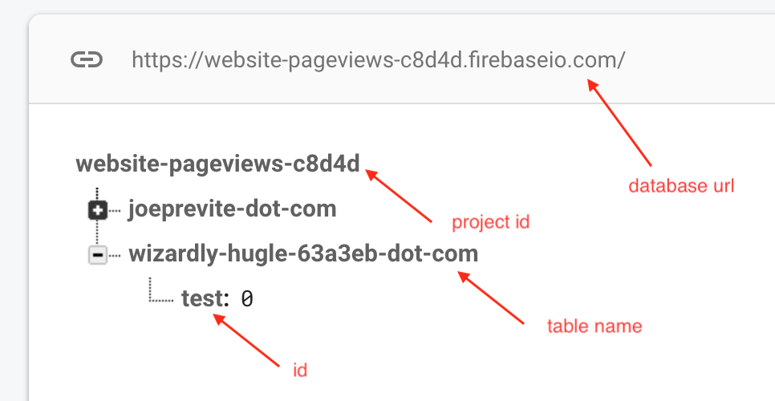

# Gatsby with Firebase and Netlify Functions

A simple example to reproduce issues I'm facing trying to get Firebase and Netlify Functions to play together nicely.

## Prerequisites

- Netlify account
- Firebase account
- Firebase project
- Service account credentials

[This guide](https://leerob.io/blog/real-time-post-views#setting-up-firebase) walks you through setting Firebase up.

Here is a screenshot of the database set up:

When the `/increment?id=test` function endpoint is hit, it should increment `test` under "wizardly-hugle-63a3eb-dot-com".

## Local Development

1. `git clone https://github.com/jsjoeio/gatsby-netlify-firebase-basic.git`
2. `cd gatsby-netlify-firebase-basic`
3. `yarn`
4. Duplicate `.env.example` as `.env` and update values (see photo above)
5. `yarn start`
6. Navigate to [http://localhost:8000/.netlify/functions/increment?id=test](http://localhost:8000/.netlify/functions/increment?id=tes)

If it is working as expected, you should see "totalViews" increment each time you hit that endpoint.

## Reproducing issue in Production Environment

1. Connect git repo with Netlify
2. Deploy site
3. Add environment variables

_Note: when you add the `FIREBASE_PRIVATE_KEY` as an env variable, make sure it is inside quotes_

4. Test

### Expected Results

### Actual Results

## Resources

- [`gatsby-starter-hello-world`](https://github.com/gatsbyjs/gatsby-starter-hello-world)
- [Turning the Static Dynamic: Gatsby + Netlify Functions + Netlify Identity](https://www.gatsbyjs.org/blog/2018-12-17-turning-the-static-dynamic/)
- [Using Firebase Admin SDK with Netlify Lambda Functions](https://dev.to/jackabox/using-firebase-admin-sdk-with-netlify-lambda-functions-4h8e)
